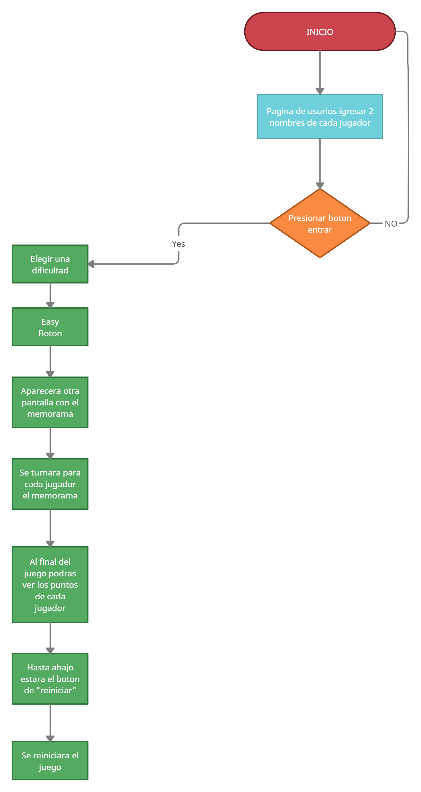
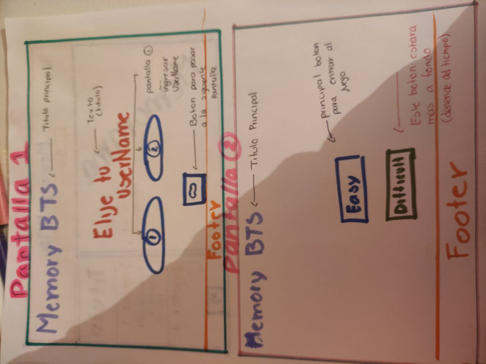
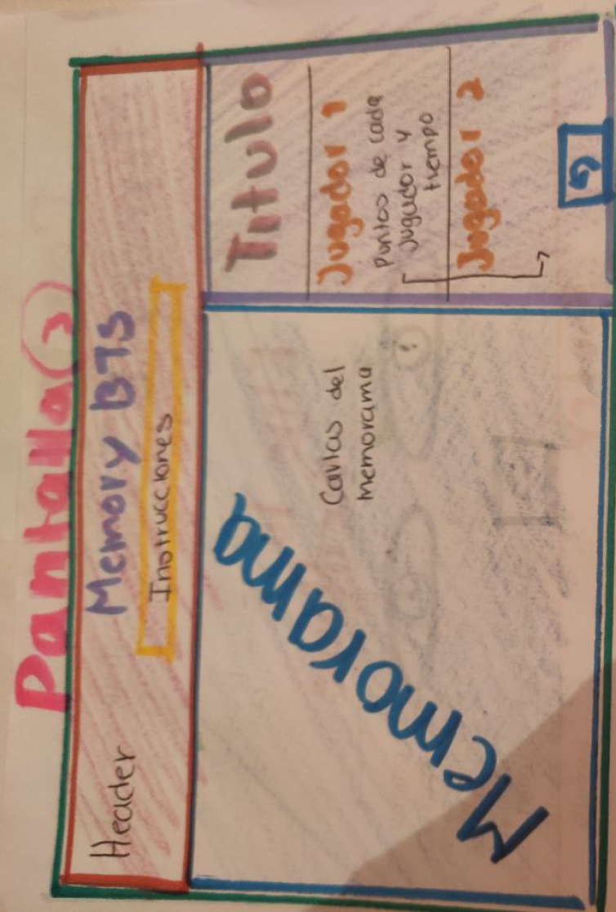
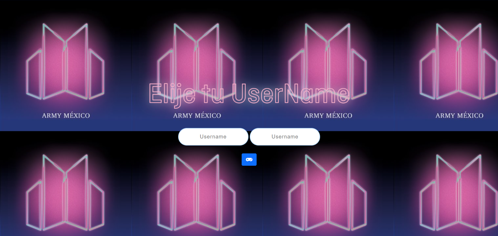
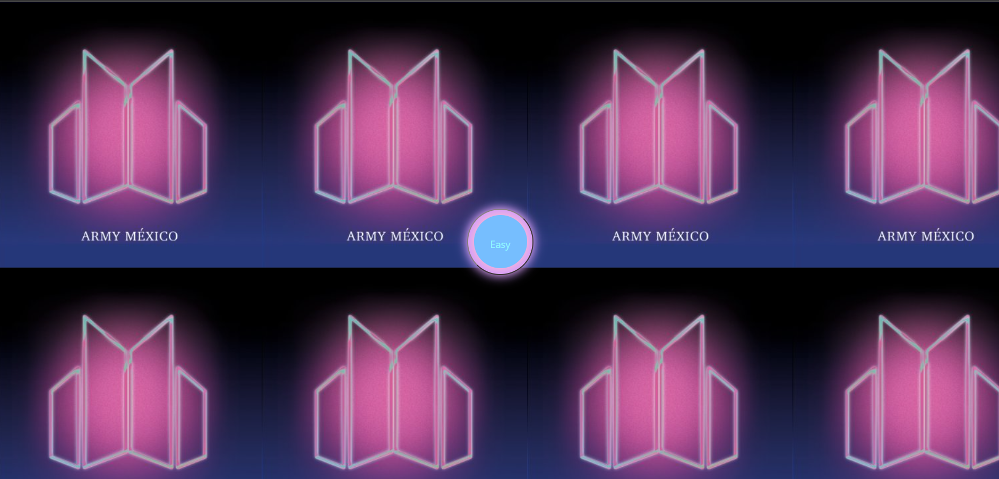
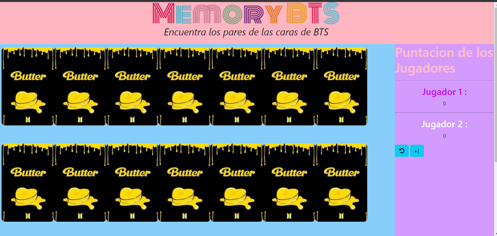
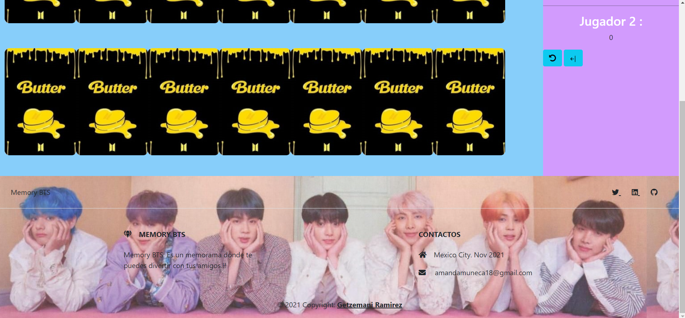

# Memory_BTS

---

Índice

    1. Description
    2. User Definition & User Stories (UX)
    3. Diagrama de flujo
    4. Maquetacion de Pagina
    5. Pagina Final
    6. Link
    7. Lenguajes utilizados
    8. Footer

---

## 1. Descripcion

**Memory_BTS :** Memorama para jugar con un amigo. El memorama se tratara de encontrar las caras de BTS.

---

## 2. Definicion de Usuario

El memorama trata de encontrar las caras de BTS(Grupo coreano), el juego contara:

- Agregaran sus usernames
- Despues habra un boton para ir a un memorama facil
- Entraras al memorama y veras las cartas principales
- contara con una tabla de cada jugador y su puntuacion
- Tendra un boton de reinicio para volver a jugar
- Tendra un boton para regresar a la pantalla principal

---

## 3. Diagrama de Flujo

---

## 4. Maquetacion de Pagina

---

## 5. Pagina Final

---

## 6. Link

[LInk](https://getzemani18.github.io/Memory_BTS/src/index.html)

## 7. Lenguajes Utilizados

- HTML5
- CSS3
- JavaScript

## 8. Footer

© Copyright 2021-Proyecto#5-Memory Game
Getzemani Ramirez
